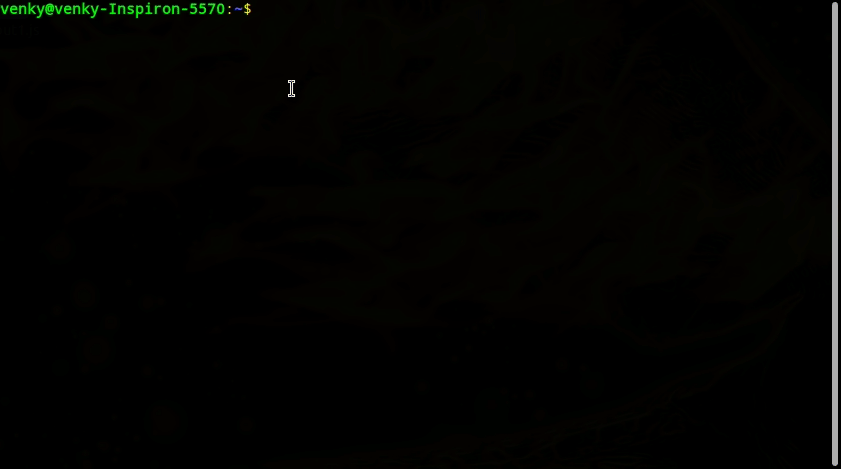
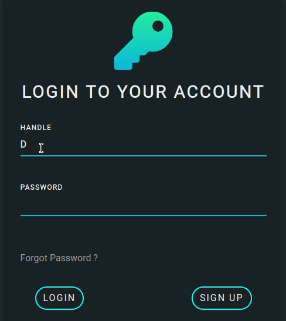
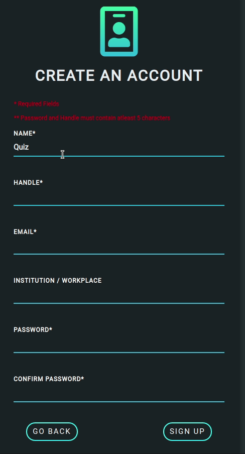
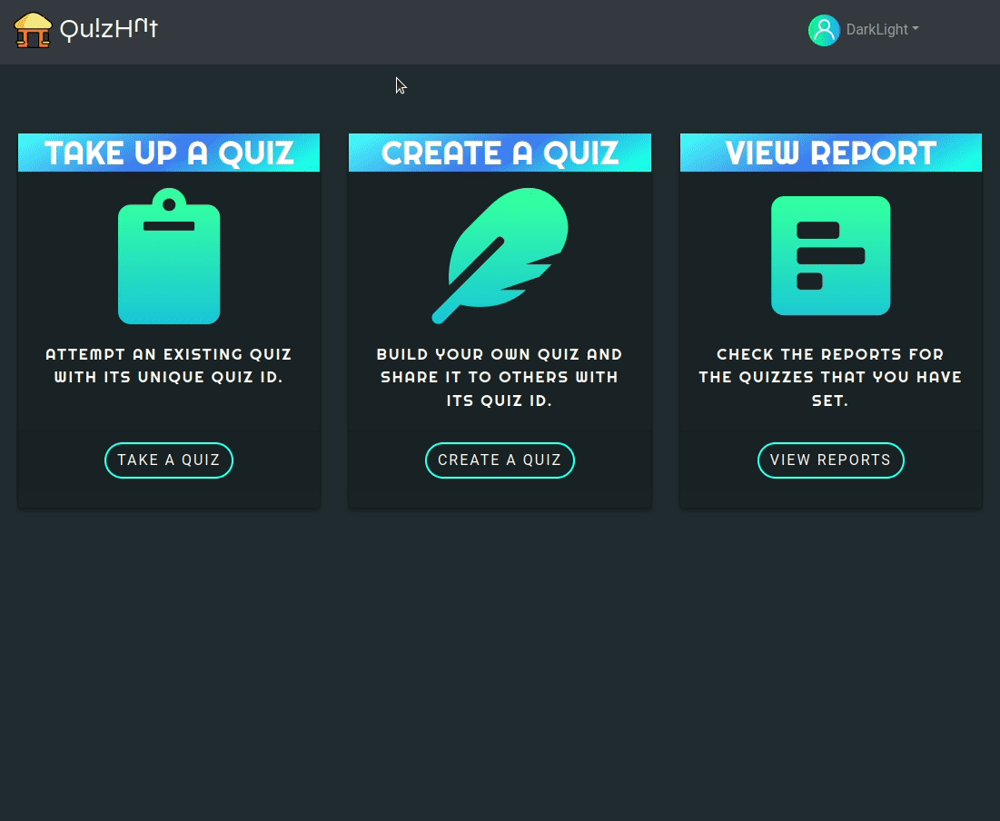
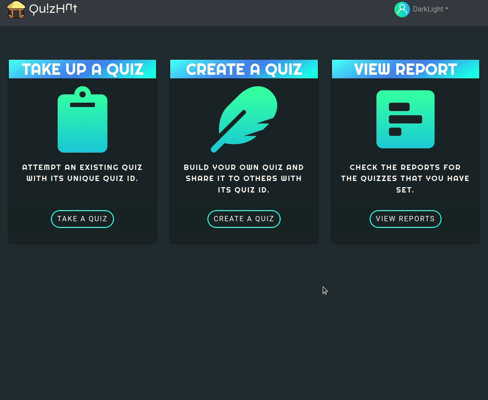
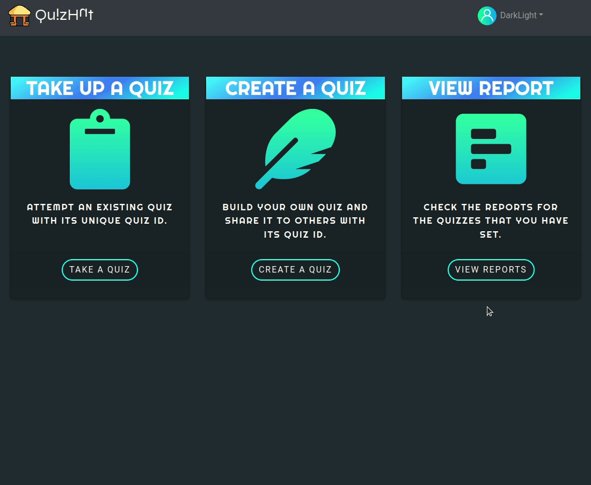
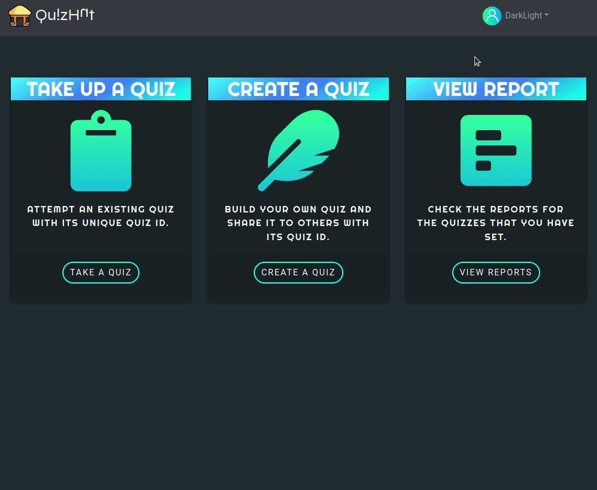

# QuizHut v1.0
[](http://quizhut.herokuapp.com/)

🔗 You can experience our project out here : http://quizhut.herokuapp.com/


A website built in ReactJS, that allows users to create their own quizzes or take quizzes created by others. 

## About
- Users can Signup and create an acount by providing the required credentials.
- Upon signing in, the users can create a Quiz, or take a Quiz created by others by providing a unique QuizID .

## Running in localhost
### Installation - Windows, Linux and Mac
#### Clone the repository
```bash
git clone https://github.com/svishakan/OOAD-Project.git
```
#### Move to the app directory
```bash
cd OOAD-Project/quiz-app/
```
#### Add ```.env``` file in quiz-app/
1. Create a Project in https://console.firebase.google.com/
1. Obtain the enviroinment varibles for your project - [refer from here](https://youtu.be/3ZEz-iposj8)
1. Create an account in [EmailJS.com](https://dashboard.emailjs.com/sign-in) 
1. Obtain the enviroinment Variables for EmailJS  - [refer from here](https://youtu.be/NgWGllOjkbs)
1. Add a HMAC key to you file.

#### Install node modules and other dependent packages
```zsh
npm install
```
#### Start the project
```
npm start
```



The App should be open in your browser now, if not us paste this in your Browser
```
localhost:<PORT>/
``` 

The port for React-App is gerneraly 3000, if not, check your terminal and use the port number specified there.

## Documentation
The [Software Documentation](./Documentation/) of the project consists of Detailed UML Diagrams explaining the planning  that went behind this Project

## Features

### Basic Authentication 

### Login into an existing account



### Create a new account with Unique handle



### Take up a Quiz




### Create a new Quiz





### View Quiz Reports




### Other Features




## Footnote

<div>

<span>POWERED BY <a href="https://www.freepik.com/">FREEPIK</span>
</div>